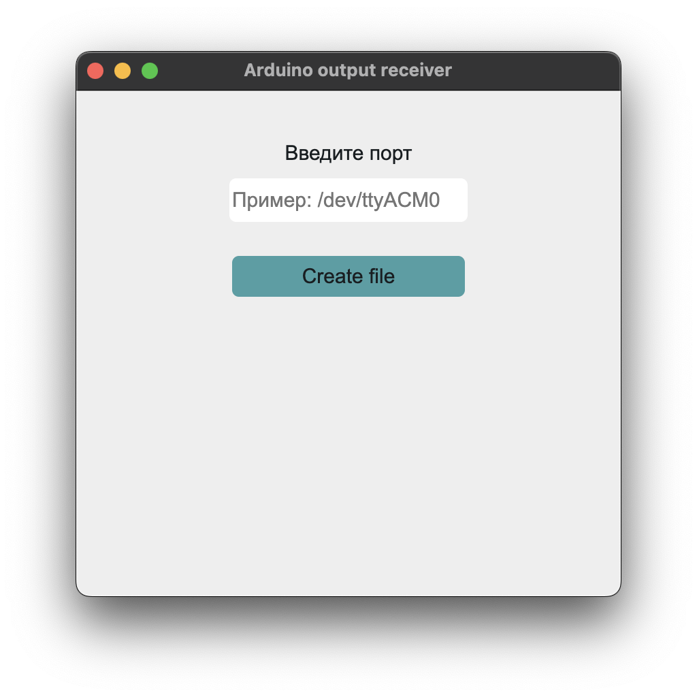

# Welcome to Data Receiver 👋


[](#)

> Desktop util for write data from Arduino to file
> 

## Clone

```js
git clone // repo UPL

```

## Install

```sh
yarn
```

## Usage

```sh
yarn start
```

## Package (Package windows app on mac is making by third-party utils)

```sh
yarn package
```

## Show your support

Give a ⭐️ if this project helped you!
